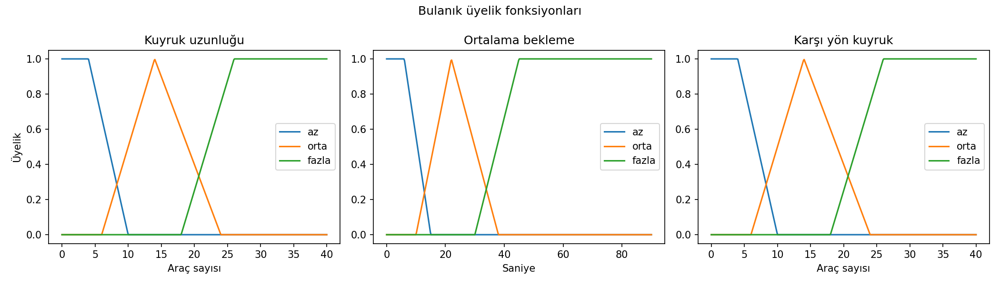
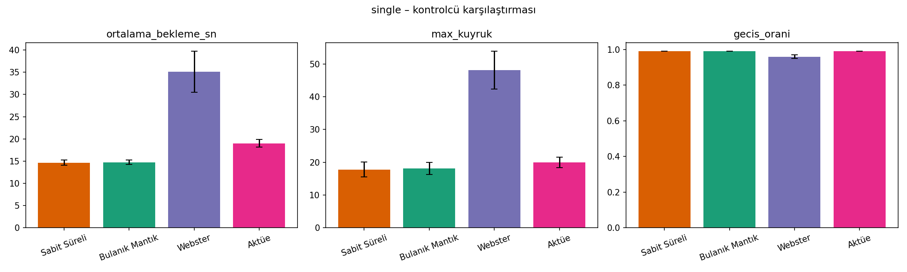
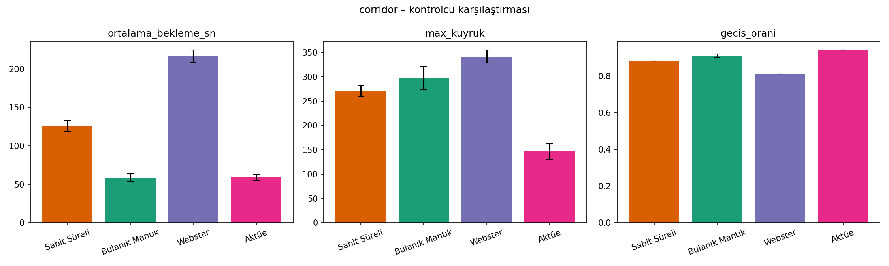
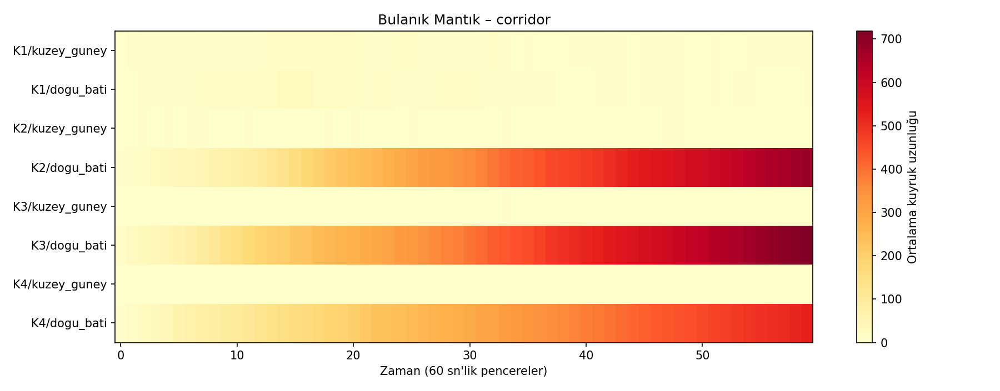
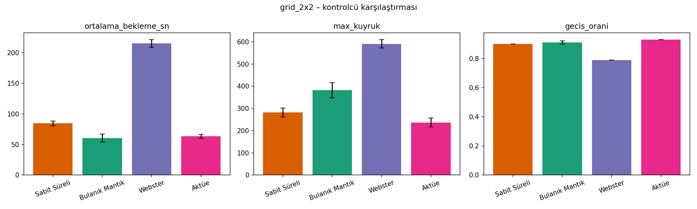
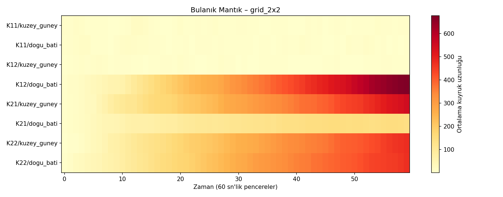
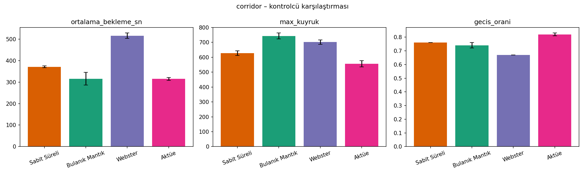
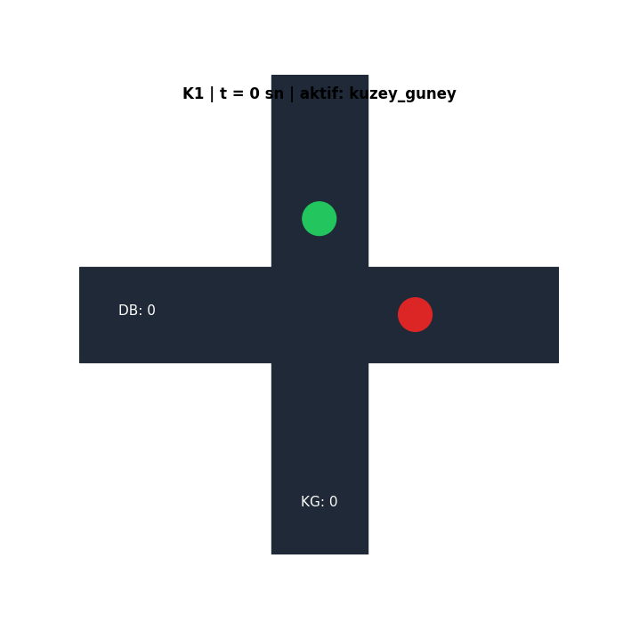

# Bulanik Mantik ile Akilli Trafik Isigi Simulasyonu

Benzetim Programlari final projesi - Ali Alizada

Trafik isiklarini sabit sureli yerine bulanik mantikla anlik trafige gore ayarlayan bir sistem. Tek kavsak, 4 kavsakli koridor ve 2x2 grid icin sentetik veriyle ve IBB gercek verisiyle 4 farkli kontrolcuyu (Sabit, Bulanik, Webster, Aktue) karsilastiriyor.

## Ozellikler

- 4 kontrolcu: Sabit Sureli, Bulanik (3 girdili), Webster, Aktue
- 3 topoloji: tek kavsak, koridor, 2x2 grid
- 2 veri kaynagi: sentetik + IBB acik veri (Saatlik Trafik Yogunluk)
- SimPy ile ayrik olay benzetimi
- 15 farkli tohumla calistirma + Welch t-testi
- SUMO entegrasyonu (TraCI)
- Streamlit arayuzu

## Kurulum

```bash
pip install -r requirements.txt
```

## Calistirma

Arayuz icin:
```bash
py -m streamlit run app.py
```

Komut satirindan:
```bash
py -m src.main --tohum 15 --dakika 60
py -m src.main --ibb data/traffic_density_202501.csv
```

IBB verisini indirmek:
```bash
curl -L -o data/traffic_density_202501.csv "https://data.ibb.gov.tr/dataset/3ee6d744-5da2-40c8-9cd6-0e3e41f1928f/resource/57cb067b-1a0b-460b-8342-7884bd4537e8/download/traffic_density_202501.csv"
```

## Benzetim Teknikleri

- Ayrik Olay Benzetimi (SimPy)
- Poisson sureci ile arac gelisi
- Monte Carlo (15 farkli tohumla tekrar)
- SimPy + SUMO birlikte (mezzo + mikro)
- IBB verisinden gelen lambda(t) profili
- Ortak rastgele sayilar (CRN)
- Welch t-testi ile dogrulama

## Bulanik Kontrolcu

3 girdi:
- Kuyruk uzunlugu (az / orta / fazla)
- Bekleme suresi (az / orta / fazla)
- Karsi yon kuyrugu (az / orta / fazla)

Cikti: yesil isik suresi 12-40 saniye arasi, agirlikli ortalama ile durulastirma.



## Sonuclar

Her senaryo 15 farkli tohumla 60 dakika calistirildi.

### Tek kavsak (sentetik)

Az yogunlukta kontrolculer birbirine yakin sonuc veriyor, sabit sureli zaten yetiyor.



| Kontrolcu | Bekleme (sn) | Max kuyruk |
|---|---:|---:|
| Sabit Sureli | 14.65 | 17.8 |
| Bulanik | 14.76 | 18.1 |
| Webster | 35.1 | 48.1 |
| Aktue | 19.0 | 20.0 |

### Koridor / 4 kavsak (sentetik)

Burada bulanik mantik isi yapiyor. Sabit %53 daha kotu calisiyor.



| Kontrolcu | Bekleme (sn) | Max kuyruk |
|---|---:|---:|
| Sabit Sureli | 125.7 | 270.9 |
| Bulanik | 58.7 | 296.9 |
| Webster | 216.2 | 341.3 |
| Aktue | 58.9 | 146.5 |



### 2x2 Grid (sentetik)



| Kontrolcu | Bekleme (sn) | Max kuyruk |
|---|---:|---:|
| Sabit Sureli | 84.6 | 281.5 |
| Bulanik | 60.7 | 381.9 |
| Webster | 215.1 | 590.7 |
| Aktue | 63.2 | 236.7 |



### IBB gercek veri (yogun trafik)

IBB'nin en yogun geohash hucrelerinde trafik cok dolu, bulanik yesil araligi (12-40 sn) yetmiyor. Burada Aktue daha iyi.



| Kontrolcu | Bekleme (sn) | Max kuyruk |
|---|---:|---:|
| Sabit Sureli | 371.1 | 627.9 |
| Bulanik | 315.5 | 743.0 |
| Webster | 516.0 | 701.8 |
| Aktue | 315.1 | 556.5 |

### Welch t-testi

Sabit Sureli'ye gore karsilastirma (pozitif = daha iyi):

Sentetik veri:

| Topoloji | Bulanik | Webster | Aktue |
|---|---:|---:|---:|
| Tek kavsak | -0.31 | -9.49 | -8.80 |
| Koridor | +16.56 | -17.95 | +17.67 |
| Grid | +6.78 | -37.59 | +9.01 |

IBB veri:

| Topoloji | Bulanik | Webster | Aktue |
|---|---:|---:|---:|
| Tek kavsak | -0.53 | -24.39 | -2.23 |
| Koridor | +4.01 | -23.83 | +14.94 |
| Grid | -12.06 | -56.89 | +11.10 |

## Canli Animasyon



## SUMO (opsiyonel)

SUMO kuruluysa:
```bash
sumo-gui -c results/final/single/sumo/scenario.sumocfg
```

TraCI uzerinden bulanik kontrolcuyle:
```bash
pip install traci sumolib
py -m src.sumo.runner --scenario results/final/corridor/sumo/scenario.sumocfg --gui
```

## Dosyalar

```
app.py            Streamlit arayuzu
src/              Kaynak kod (controllers, network, stats, sumo, viz)
docs/images/      Gorsel
RAPOR.docx        Detayli rapor
```

## Kullanilan kutuphaneler

Python, SimPy, pandas, numpy, matplotlib, streamlit. SUMO + traci opsiyonel.
